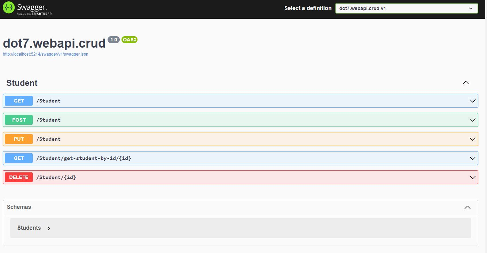

# .Net 7 - Web API Tutorial
.Net 7 | Web API | Entity Framework | CRUD Tutorial

## Table of contents
* [General info](#general-info)
* [Screenshots](#screenshots)
* [Projects](#Projects)
* [Code Examples](#code-examples)

## General info
In examples it is used in SQL Server database. In this article, we are going to implement a sample .NET 7 Web API CRUD using the Entity Framework Core.
Web API is a framework for building HTTP services that can be accessed from any client like browser, mobile devices, and desktop apps.

## Screenshots



## Projects
- Web API
- Entity Framework
- .Net 7

## Code Examples
Show examples of usage:
```
   using dot7.API.Crud.Data;
using Microsoft.AspNetCore.Mvc;
 
namespace dot7.API.Crud.Controllers;
 
[ApiController]
[Route("[controller]")]
public class StudentsController: ControllerBase
{
    private readonly MyWorldDbContext _myWorldDbContext;
    public StudentsController(MyWorldDbContext myWorldDbContext)
    {
        _myWorldDbContext = myWorldDbContext;
    }
}

```
